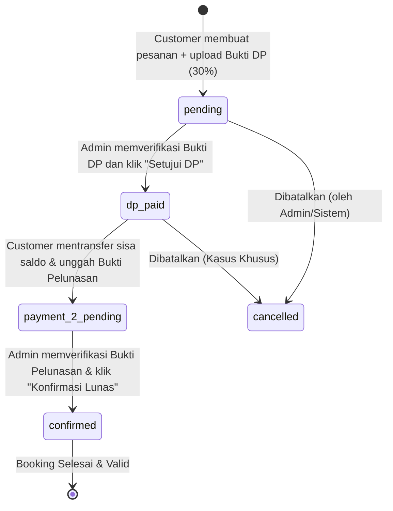

# Dokumentasi Proyek: Aplikasi Booking Lapangan HAM

Dokumen ini merupakan gambaran menyeluruh (Overview) dari proyek **Aplikasi Booking Lapangan HAM** (Stadion H. Abdul Malik). Dokumen ini dirancang sebagai berkas *Context Knowledge* utama untuk memberikan pemahaman instan mengenai struktur kode, arsitektur data, alur logika bisnis, dan teknologi yang digunakan kepada AI Coding Assistants lainnya.

---

## 1. Ringkasan Proyek

Aplikasi Booking Lapangan HAM adalah sistem reservasi lapangan olahraga berbasis web. Aplikasi ini membagi fungsionalitasnya menjadi dua area utama:
*   **Customer Portal**: Tempat pelanggan melakukan pendaftaran akun, melihat ketersediaan lapangan, memesan slot jadwal (dengan kalkulasi harga real-time berbasis slot waktu), mengunggah bukti pembayaran DP (30%), melakukan pelunasan sisa tagihan, dan memantau riwayat transaksi.
*   **Admin Dashboard**: Dasbor manajemen bagi pengelola untuk memverifikasi bukti transaksi (DP dan Pelunasan), mengelola data lapangan (aktif/nonaktif, harga, alamat, gambar), serta melihat laporan statistik pendapatan real-time.

---

## 2. Spesifikasi Teknologi (Tech Stack)

Aplikasi ini dibangun menggunakan arsitektur sederhana namun kokoh, tanpa framework backend yang rumit (*Vanilla/Native PHP*), guna memastikan performa maksimal dan kemudahan hosting.

*   **Backend**: PHP Native (Versi 7.4 ke atas kompatibel).
*   **Database**: MySQL / MariaDB dengan koneksi **PDO (PHP Data Objects)** untuk keamanan query terproteksi dari SQL Injection.
*   **Frontend**:
    *   **Bootstrap 5.3.x** (melalui CDN) untuk sistem grid responsif dan tata letak UI.
    *   **Vanilla JavaScript (ES6)** untuk manipulasi DOM dan kalkulasi harga secara real-time pada formulir pemesanan.
    *   **Flatpickr** untuk date & time selector yang dinamis dan mendukung pelokalan (Bahasa Indonesia).
    *   **SweetAlert2** untuk pop-up/alert interaktif dan modern.
    *   **DataTables** untuk penyajian tabel data yang responsif, terpaginasi, dan dapat difilter di sisi Admin secara dinamis.
*   **Keamanan**:
    *   `password_hash` & `password_verify` bawaan PHP untuk pengamanan kredensial user.
    *   Prepared Statements di setiap query SQL untuk mencegah SQL Injection.
    *   Sanitasi HTML input untuk mencegah Cross-Site Scripting (XSS).
    *   Proteksi akses halaman menggunakan middleware berbasis sesi (`session`).

---

## 3. Struktur Direktori & Komponen

```
/Users/royanrosyad/Nayor/filq-proj/
├── admin/                          # Modul Halaman Administrator
│   ├── index.php                   # Dasbor Statistik Utama Admin
│   ├── fields/                     # Manajemen CRUD Lapangan (Termasuk upload gambar slider)
│   │   ├── index.php               # Daftar Lapangan & Kelola Gambar
│   │   ├── create.php              # Form Tambah Lapangan Baru
│   │   ├── edit.php                # Form Ubah Lapangan
│   │   └── delete.php              # Logika Hapus Lapangan
│   └── bookings/                   # Verifikasi Pembayaran & Status Reservasi
│       └── index.php               # List Booking + Aksi Verifikasi DP/Pelunasan
│
├── auth/                           # Modul Autentikasi Pengguna
│   ├── login.php                   # Form Login Customer & Admin
│   ├── register.php                # Form Registrasi Customer (dilengkapi validasi Nomor Telepon)
│   ├── logout.php                  # Hapus Sesi & Redirect
│   ├── process_login.php           # Logika Pemrosesan Autentikasi
│   └── process_register.php        # Logika Pemrosesan Registrasi
│
├── customer/                       # Modul Dashboard & Reservasi Pelanggan
│   ├── index.php                   # Dasbor Ringkas Statistik Customer
│   ├── fields/                     # Informasi Lapangan Olahraga & Harga
│   │   └── index.php
│   ├── booking/                    # Sistem Pemesanan Lapangan
│   │   ├── create.php              # Form Reservasi (Kalkulator Harga Real-time + Upload DP)
│   │   └── update_payment.php      # Form Pelunasan Booking (Upload Bukti Bayar Ke-2)
│   └── history.php                 # Riwayat Booking & Tombol Aksi Pelunasan
│
├── config/                         # Berkas Konfigurasi Utama
│   ├── database.php                # Koneksi PDO MySQL (Default Port: 3307)
│   ├── constants.php               # Konfigurasi Aplikasi (Nama Stadion, Porsi DP, Rekening Bank)
│   └── images.php                  # Konfigurasi Asset Gambar Default & URL Unsplash
│
├── database/                       # Skema SQL & Berkas Migrasi Database
│   ├── schema.sql                  # Skema Database Awal & Dummy Data
│   ├── migration_add_payment_proof.sql   # Migrasi Bukti Bayar DP
│   ├── migration_add_payment_proof_2.sql # Migrasi Bukti Bayar Pelunasan & Status Transisi
│   ├── migration_add_phone.sql           # Tambah Kolom Nomor Telepon pada User
│   └── migration_add_address.sql         # Tambah Kolom Alamat Lapangan
│
├── includes/                       # Skrip Fungsi, Layout, & Sistem Middleware
│   ├── functions.php               # Helper Utama (Format Mata Uang, Waktu, & Kalkulator Slot Harga)
│   ├── mail_functions.php          # SMTP/Native Mailer untuk Notifikasi Pembayaran via Email
│   ├── middleware.php              # Pembatas Hak Akses (Customer vs Admin vs Guest)
│   ├── upload_functions.php        # Validasi Unggahan Gambar/Bukti Pembayaran
│   ├── admin/                      # Template Layout Dasbor Admin (Header & Footer)
│   └── customer/                   # Template Layout Dasbor Pelanggan (Header & Footer)
│
├── uploads/                        # Direktori File Upload (CHMOD 777)
│   ├── payment_proofs/             # Bukti Transfer Pembayaran Pelanggan (DP & Pelunasan)
│   └── fields/                     # Foto Lapangan
│
├── index.php                       # Router Entry Point (Redirect otomatis berdasarkan status login)
├── about.php                       # Landing Page Publik (Daftar Lapangan & Slider Gambar Promosi)
├── .htaccess                       # Konfigurasi Server Apache
├── CLAUDE.md                       # Panduan Kerja Developer/AI Agent
├── README.md                       # Penjelasan Umum Proyek
└── INSTALLATION.md                 # Panduan Instalasi Lokal
```

---

## 4. Skema Database

Berikut adalah relasi data serta tipe data kolom hasil gabungan `schema.sql` dan berkas migrasi database teranyar:

### A. Tabel: `users`
Menyimpan data akun administrator maupun pelanggan.
```sql
CREATE TABLE users (
    id INT AUTO_INCREMENT PRIMARY KEY,
    name VARCHAR(255) NOT NULL,
    email VARCHAR(255) NOT NULL UNIQUE,
    phone VARCHAR(20) NULL, -- Menyimpan No. Telp/WhatsApp (Hasil Migrasi)
    password VARCHAR(255) NOT NULL,
    role ENUM('admin', 'customer') DEFAULT 'customer',
    created_at TIMESTAMP DEFAULT CURRENT_TIMESTAMP,
    INDEX idx_email (email),
    INDEX idx_role (role)
) ENGINE=InnoDB DEFAULT CHARSET=utf8mb4 COLLATE=utf8mb4_unicode_ci;
```

### B. Tabel: `fields` (Lapangan)
Menyimpan data lapangan olahraga yang tersedia.
```sql
CREATE TABLE fields (
    id INT AUTO_INCREMENT PRIMARY KEY,
    name VARCHAR(255) NOT NULL,
    price DECIMAL(10, 2) NOT NULL, -- Harga dasar per jam (untuk acuan default)
    address VARCHAR(255) NULL, -- Alamat spesifik lapangan (Hasil Migrasi)
    status ENUM('active', 'inactive') DEFAULT 'active',
    created_at TIMESTAMP DEFAULT CURRENT_TIMESTAMP,
    updated_at TIMESTAMP DEFAULT CURRENT_TIMESTAMP ON UPDATE CURRENT_TIMESTAMP,
    INDEX idx_status (status)
) ENGINE=InnoDB DEFAULT CHARSET=utf8mb4 COLLATE=utf8mb4_unicode_ci;
```

### C. Tabel: `bookings`
Menyimpan detail reservasi, histori pembayaran dua tahap, dan status.
```sql
CREATE TABLE bookings (
    id INT AUTO_INCREMENT PRIMARY KEY,
    user_id INT NOT NULL,
    field_id INT NOT NULL,
    booking_date DATE NOT NULL,
    start_time TIME NOT NULL,
    end_time TIME NOT NULL,
    price DECIMAL(10, 2) NOT NULL,       -- Total Biaya Hasil Kalkulasi Slot
    dp_amount DECIMAL(10, 2) NOT NULL,   -- Nilai DP minimal 30% dari Total Biaya
    payment_proof VARCHAR(255) NULL,      -- Path Foto Bukti Transfer DP (Tahap 1)
    payment_proof_uploaded_at TIMESTAMP NULL,
    payment_proof_2 VARCHAR(255) NULL,    -- Path Foto Bukti Transfer Pelunasan (Tahap 2)
    payment_proof_2_uploaded_at TIMESTAMP NULL,
    status ENUM('pending', 'dp_paid', 'payment_2_pending', 'paid', 'confirmed', 'cancelled') DEFAULT 'pending',
    created_at TIMESTAMP DEFAULT CURRENT_TIMESTAMP,
    updated_at TIMESTAMP DEFAULT CURRENT_TIMESTAMP ON UPDATE CURRENT_TIMESTAMP,
    FOREIGN KEY (user_id) REFERENCES users(id) ON DELETE CASCADE,
    FOREIGN KEY (field_id) REFERENCES fields(id) ON DELETE CASCADE,
    INDEX idx_user_id (user_id),
    INDEX idx_field_id (field_id),
    INDEX idx_booking_date (booking_date),
    INDEX idx_status (status),
    -- Proteksi Double Booking di tingkat database
    UNIQUE KEY unique_booking (field_id, booking_date, start_time, end_time)
) ENGINE=InnoDB DEFAULT CHARSET=utf8mb4 COLLATE=utf8mb4_unicode_ci;
```

---

## 5. Logika Bisnis Utama

### A. Autentikasi & Kontrol Akses (Middleware)
Fungsi middleware di `includes/middleware.php` membatasi halaman berdasarkan peran user:
*   `requireLogin()`: Memaksa redirect ke halaman login apabila sesi `user_id` belum terdaftar.
*   `requireAdmin()`: Memeriksa apakah user login memiliki role `admin`. Jika tidak, dilempar ke dasbor customer.
*   `requireCustomer()`: Memeriksa apakah user login ber-role `customer`. Jika tidak, dilempar ke dasbor admin.
*   `redirectIfLoggedIn()`: Dipakai di halaman login/register agar otomatis mengarahkan user yang sudah masuk ke dasbornya masing-masing.

### B. Alur Transisi Pembayaran & Status Booking (State Machine)
Pemesanan lapangan mewajibkan sistem pembayaran bertahap dengan status dinamis:



1.  **Status `pending`**: Jadwal dipesan, slot dikunci. Pelanggan wajib mengunggah bukti bayar DP minimal 30% dari total tagihan.
2.  **Status `dp_paid`**: Admin memverifikasi bukti transfer DP. Sistem mengirim email notifikasi pertama. Di sisi pelanggan, tombol **"Pelunasan"** akan aktif di riwayat transaksi.
3.  **Status `payment_2_pending`**: Pelanggan mengunggah bukti transfer kedua (Pelunasan). Admin harus memverifikasinya kembali.
4.  **Status `confirmed` / `paid`**: Bukti pelunasan terverifikasi valid oleh Admin. Sistem mengirim email konfirmasi final. Pelanggan siap bermain.
5.  **Status `cancelled`**: Pesanan dibatalkan (jadwal dibebaskan kembali).

### C. Tabel Tarif Berdasarkan Slot Waktu (Sync Slot Pricing)
Tarif pemesanan tidak dihitung flat, melainkan dinamis tergantung pada kombinasi **Hari** (*Weekday*, *Friday*, *Weekend*) dan **Jam Bermain** (2-jam per slot). Tabel harga didefinisikan pada `includes/functions.php`:

| Waktu Slot | Hari Kerja (Weekday) | Hari Jumat (Friday) | Akhir Pekan (Weekend) |
| :--- | :--- | :--- | :--- |
| **06:00 – 08:00** | *Tidak Tersedia (N/A)* | *Tidak Tersedia (N/A)* | Rp 2.600.000 |
| **08:00 – 10:00** | Rp 1.300.000 | *Tidak Tersedia (N/A)* | Rp 2.600.000 |
| **10:00 – 12:00** | Rp 800.000 | *Tidak Tersedia (N/A)* | Rp 1.500.000 |
| **12:00 – 14:00** | Rp 800.000 | *Tidak Tersedia (N/A)* | Rp 1.500.000 |
| **14:00 – 16:00** | Rp 1.300.000 | Rp 1.300.000 | Rp 2.600.000 |
| **16:00 – 18:00** | Rp 2.000.000 | Rp 2.300.000 | Rp 2.600.000 |
| **18:00 – 20:00** | Rp 2.300.000 | Rp 2.500.000 | Rp 2.800.000 |
| **20:00 – 22:00** | Rp 2.300.000 | Rp 2.500.000 | Rp 2.800.000 |

*   **Kalkulator Otomatis**: Form `customer/booking/create.php` menggunakan JavaScript untuk mendeteksi perubahan tanggal dan jam bermain secara instan, lalu menembak fungsi kalkulasi dan memunculkan total harga serta nominal DP 30% sebelum submit.

### D. Sistem Proteksi Bentrok Jadwal (Double-Booking Prevention)
Proteksi bentrok jadwal dilakukan berlapis:
1.  **Database Level**: `UNIQUE KEY unique_booking (field_id, booking_date, start_time, end_time)` mencegah penulisan slot yang persis sama.
2.  **Logic Level (`isTimeSlotAvailable` di `functions.php`)**:
    Query sql mengecek irisan waktu bermain pada tanggal yang sama untuk booking yang statusnya **bukan** `cancelled`:
    ```sql
    SELECT COUNT(*) FROM bookings 
    WHERE field_id = ? AND booking_date = ? AND status != 'cancelled'
    AND ((start_time <= ? AND end_time > ?) OR
         (start_time < ? AND end_time >= ?) OR
         (start_time >= ? AND end_time <= ?))
    ```
    Jika hitungan query mengembalikan angka `> 0`, transaksi pemesanan baru pada jam tersebut ditolak oleh sistem.

### E. Sistem Notifikasi Email & Log (Mailer)
*   Menggunakan fungsi `sendEmailNotification($to, $subject, $message)` di `includes/mail_functions.php` yang memanfaatkan fungsi bawaan PHP (`mail()`).
*   Mengirim template email HTML ramah pengguna ketika status pembayaran di-approve admin.
*   **Logging Mode**: Karena di localhost fitur kirim email asli sering terhambat, email yang terkirim akan **di-duplikasi dan dicatat ke dalam berkas log lokal** di: `logs/email_notifications.log` untuk kemudahan pengujian pengembang.

---

## 6. Pengaturan Variabel Utama Aplikasi

Pengembang dapat menyesuaikan variabel global di `config/constants.php`:
*   `APP_NAME`: Nama sistem/aplikasi.
*   `STADIUM_NAME`: Nama stadion/arena olahraga.
*   `DP_PERCENTAGE`: Persentase uang muka (DP) default (Saat ini diset `30`%).
*   `MIN_DP_AMOUNT`: Minimal pembayaran DP yang harus dibayar customer (Saat ini diset Rp 500.000).
*   `BANK_NAME`, `BANK_NUMBER`, `BANK_HOLDER`: Informasi rekening tujuan pembayaran pelanggan.

---

## 7. Cara Menjalankan & Menguji Proyek

### A. Perintah-perintah Berguna (Commands)
*   **Melakukan Pengecekan Sintaks PHP (Linting)**:
    ```bash
    find . -name "*.php" -not -path "*/vendor/*" | xargs -n 1 php -l
    ```
*   **Melakukan Cek Koneksi Database**:
    ```bash
    php -f test.php
    ```
*   **Melakukan Cek Status Update Reservasi**:
    ```bash
    php -f test_booking.php
    ```
*   **Menjalankan Local Development Server**:
    ```bash
    php -S localhost:8000
    ```

### B. Akun Administrator Default (Untuk Demo/Pengujian)
*   **Email**: `admin@bookinglapangan.com`
*   **Password**: `admin123`
